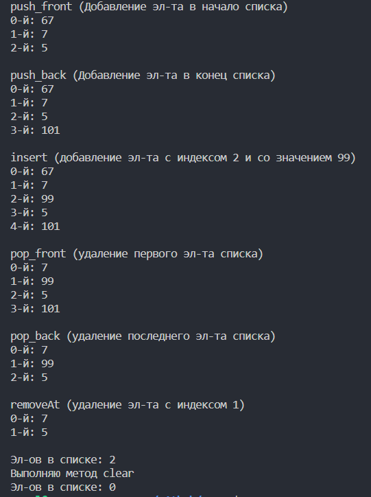

# CAKOD

## О программе

*Создание односвязанного списка:*

1. *С реализацией функций: добавление, удаление элементов списка, печать списка на экране.*
2. *Тип данных элементов списка шаблонный.*

## Как запустить (linux)

*Для запуска программы небходимо:*

1. `g++ -Wall one_spisk.cpp -o one_spisk`
2. `./one_spisk`
3. *Вывод →*

